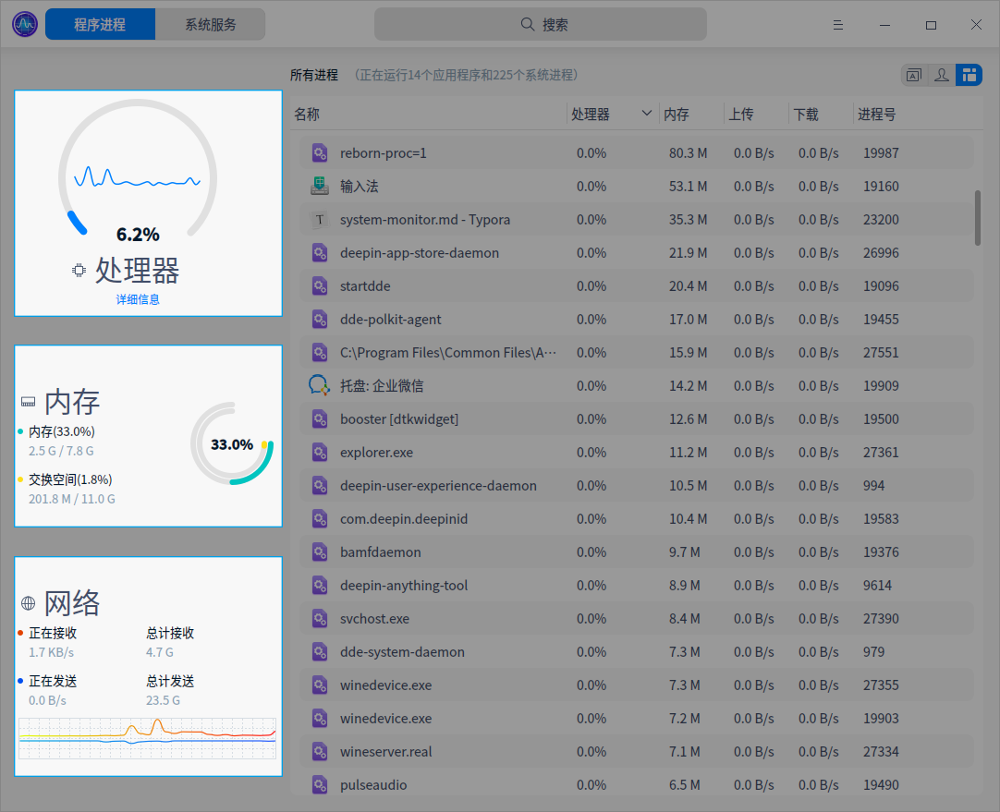

# 系统监视器|deepin-system-monitor|

## 概述

系统监视器是一个对硬件负载、程序运行、系统服务进行监测、查看和管理的系统工具。系统监视器可以实时监控处理器状态、内存占用率、网络上传下载速度、还可以管理系统进程和应用进程，也支持搜索进程和强制结束进程。

## 操作介绍

### 搜索进程

1. 在系统监视器搜索框中，单击 。
2. 输入关键字 ，实时展示搜索结果。

### 硬件监控

在系统监视器中，单击  > **视图** 选择“舒展”或“紧凑”模式来展示电脑的处理器、内存、网络和磁盘状态：

| 名称 | 说明 |
| ------------------- | ---------------|
| 处理器 |    显示处理器最近一段时间的运行负载情况。    |
| 内存 |   显示内存总量和当前占用量，交换空间大小和当前占用量。    |
| 网络 |   实时显示当前网络上传下载速度。   |
| 磁盘 |  仅在“紧凑”视图下显示；实时显示当前磁盘读取与写入速度。  |

#### 查看硬件信息
在舒展模式和紧凑模式下，均可以查看处理器、内存、网络和磁盘状态的详细信息。
1. 在系统监视器界面上，单击左侧 **详细信息**。

2. 右侧默认展开处理器的详细信息，单击处理器旁边的按钮  展开下拉菜单选项，可以选择查看内存、网络或磁盘的详细信息。

3. 单击右侧 **隐藏详情** 收起详情页。

### 程序进程管理

#### 切换进程标签

您可以单击界面右上角的图标切换进程标签，分别可以查看应用程序进程、我的进程和所有进程。

- 单击图标  切换到 **应用程序** 页面。
- 单击图标  切换到 **我的进程** 页面。
- 单击图标  切换到 **所有进程** 页面。

#### 调整进程排序

进程列表可以根据处理器、用户、内存、共享内存、虚拟内存、上传、下载、磁盘读取、磁盘写入、进程号、Nice、优先级等进行排列。

- 在系统监视器界面，单击进程列表顶部的标签，进程会按照对应的标签排序，多次单击可以切换升序和降序。
- 在系统监视器界面，右键单击进程列表顶部的标签栏，可以取消勾选标签来隐藏对应的标签列，再次勾选可以恢复显示。

#### 结束进程
您可以使用系统监视器结束系统和应用进程。
1. 在系统监视器界面上，右键单击需要结束的进程。
2. 选择 **结束进程**。
3. 在弹出的对话框中单击 **结束进程**，来确认结束该进程。

>说明：您也可以在右键菜单中选择 **强制结束进程**，强制结束进程可能会导致数据丢失，请谨慎操作。

#### 结束图形化应用程序

您可以使用系统监视器来关闭桌面上图形化的进程。

1. 在系统监视器界面上，单击 。
2. 选择 **强制结束应用程序**。   
3. 根据屏幕提示在桌面上单击想要关闭的应用窗口。
4. 在弹出的对话框中单击 **强制结束**，确认结束该应用。

>说明：若要中止上述操作，可按下键盘上 **Esc** 键返回至系统监视器界面。

#### 暂停和继续进程

您可以使用系统监视器暂停和继续进程。

1. 在系统监视器界面上，右键单击一个进程。
2. 选择 **暂停进程**，被暂停的进程会带有暂停标签。
3. 再次右键单击被暂停的进程，选择 **继续进程** 可以继续该进程。

#### 改变进程优先级

1. 在系统监视器界面上，右键单击一个进程。
2. 选择 **改变优先级** 来进行设置。
您还可以自定义进程的优先级。

#### 查看进程路径

1. 在系统监视器界面上，右键单击一个进程。
2. 选择 **查看命令所在位置**，定位该进程所在的文件夹位置。

#### 查看进程属性

1. 在系统监视器界面上，右键单击一个进程。
2. 选择 **属性**，查看进程的进程名、命令行和启动时间。

### 系统服务管理

您可以启动、停止、重新启动、设置启动方式、刷新系统服务进程。
在系统服务列表，禁止强制结束应用程序。

>注意：为系统更好的运行，请勿结束系统服务自身的进程以及根进程。

#### 启动系统服务

1. 在系统监视器界面上，选择 **系统服务** 页签。
2. 选中某个未启动的系统进程，右键单击 **启动**。
3. 弹出授权对话框，请输入密码授权，该系统服务的活动状态会置为“已启动”。
4. 右键单击系统进程，选择 **设置启动方式**，将启动方式设置为自动或者手动。
5. 右键单击 **刷新**，刷新服务列表。

   

#### 停止系统服务

1. 在系统监视器界面上，选择 **系统服务** 页签。
2. 选中某个已启动的系统进程，右键单击 **停止**。
3. 弹出授权对话框，请输入密码授权，该系统服务的活动状态会置为“未启动”。
4. 右键单击 **刷新**，刷新服务列表。

您也可以右键单击 **重新启动**，重启系统服务。

## 主菜单

在主菜单中，您可以切换监控模式、切换窗口主题、查看帮助手册、了解系统监视器的更多信息。

### 主题

窗口主题包含浅色主题、深色主题和系统主题。

1. 在系统监视器界面，单击 。
2. 选择 **主题**，选择一个主题颜色。

### 视图

系统监视器提供了舒展模式和紧凑模式，您可以根据需要选择监控信息的展示模式。

1. 在系统监视器界面，单击  。
2. 选择 **视图**，选择一种视图模式。

>说明：舒展模式和紧凑模式仅在程序进程页签中展示。

### 帮助

查看帮助手册，进一步了解和使用系统监视器。

1. 在系统监视器界面，单击  。
2. 选择 **帮助**。
3. 查看系统监视器的帮助手册。

### 关于

1. 在系统监视器界面，单击  。
2. 选择 **关于**。
3. 查看系统监视器的版本和介绍。

### 退出

1. 在系统监视器界面，单击  。
2. 选择 **退出**。

